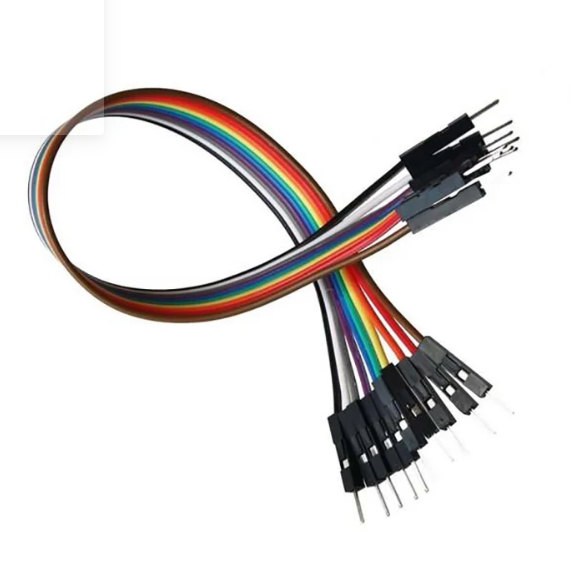
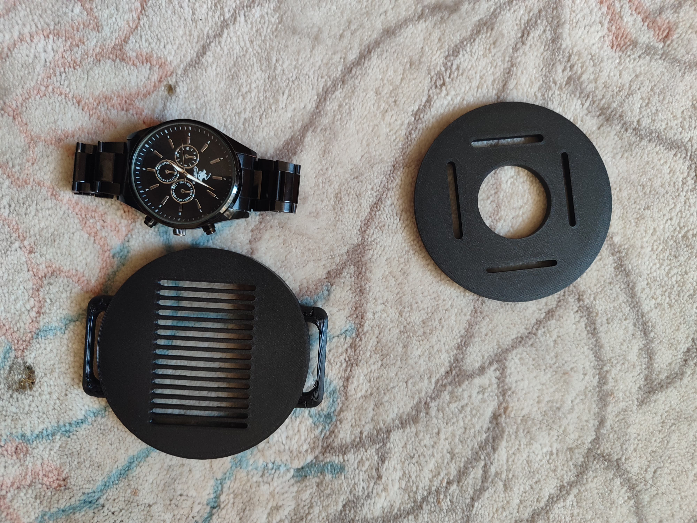

# **WELSTECH**
#### *WEARABLE LIFE SAVER TECHNOLOGY*

#### Description:
**Welstech** is a wearable prototype in a type of wrist band that aims to deliver help to people with special needs. By constantly monitoring health conditions and their current status, the wearable prototype is able to tell wether the user is in situation that needs special care and immediate attention. Later on gives alerts the people nearby through a buzzer, with beeping intervals depending on how severe the condition is.

#### Components:
I will use `esp32-s3 mini/tiny` or `esp32-s3 zero` as the main microcontroller for this project. Here are all the components I'm gping to use in the project:
    
- **ESP32-S3 Zero**: Our main microcontroller.

    
- **Buzzer**: if we find a smaller one that can fit into the prototype.

- [`Removed`] **PushButton(Silent if possible)**: To be used as an action-button.

- [`Removed/Still implementable`] **Switch**: To be used as feed or power interrupt between DCVin voltage supply and ground when necessary.

- [`Removed`] **Resistors**: a series of 10k resistors for pulldown and 330-OHM for LEDs(if necessary).

- [`Removed/Still implementable`]**Battery**: 3 pieces of 1.5 mini batteries connected in series,to output and average of 4.5V. Or 4 pieces and a silicon diode to drop voltage near 5.xV.

- **Heart Pulse Monitor Sensor**: The sensor that will sense peak values and return data about the pulse of the user.

- [`Removed`] **0.96" OLED Display**: To display data when necessary.

- **Jumper Wires**: To be used during Demo, before product release.

- [`Removed`] **Perforated Board Soldering PLate**: The main circuit plane, to be soldered onto the base.

- **Thin Wires**: Thin circuit wires to be soldered onto the Welding plate and used ın other components.

#### Algorithm:
As soon as the device is powered on with the code flashed and successfully uploaded, it shall start fetching the data from the heartrate pulse sensor, do the required normalization, calculate the average BPM and display it to the user in a human readable format. Here, after removıng the OLED Display, we are going to show the data through http protocol and continuous WiFi data streaming[locally].

If the BPM read is below a certain threshold--to be different for each user(eg. football player vs a teacher)--the buzzer will give a warning, short beeps-- or the mobile will notify the user and anybody else chosen among SOS contacts. In this mode, the action button will function as a silencer or mute button, to indicate that everything is okay. If the button is not pressed to mute the buzzer within a certain time, the buzzer play intervall will gradually increase, untill someone--rescue team or emergency service--presses it. The rescue team will be able to read from the display as well to facilitate their work in telling the user's(or patient's) current status and probably predict the reason of passing out.

#### Why **WELSTECH**?------start from here later on
Taking people with special needs into consideration and as a our main targeted audience, welstech aims to minimize the need of continuous human supervision, and decrease it to as much as possible. As previously said, if a button is not pressed within a certain amount of time, it does not necessarily mean that the user is unconcious, rather a starting point to tell the environment around it that urgent attention is needed.

#### [`OLD Schematic`] Schematics:

----

#### [`NEW Schematic`] Schematics:

#### What can be improved?

* find a smaller buzzer to use as environmental warning method.

* [`Done-with integrated BLE-WiFi`] use a bluetooth and/or wifi module to enable communication peripherals between the esp32 and a the phone.

* if we manage to find a smaller bluetooth or wifi modules, as tiny as possible we could no longer need esp32 and use microhips, such as pic16f84x, pic16f877x or stm32 chips. Thus minimizing significantly the size of the main base prototype.

## Mobile App:

Welstech Mobile is the name of the mobile app, currently almost finished, done with flutter and dart for elegancy and minimalism.

Mobile app is ready, just waiting to succedd connectiing to bluetooth with  the name specified on th code[**`ESP32_BT`**], to see if it works.

---

## Updates:
* `WiFi or Bluetooth`: 

**Wifi**: We started with Wifi.h, the plan was to use wifi for faster information and data transfer. The biggest drawback was oled's sensitivity ti heat, it could stop working as expected after a while, it was affected for being too close the esp32 main board.  And the challenge here it manage the esp32's heat dissipassion which did not turn out as easy as it looked.

**Bluetooth**: The alternative solution for this seemed to be switching to bluetooth. It's important to keep in mind that some esp board do not support `bluetooth classic` as it is in our case--ESP32S3-Zero, being Bluetooth Low Energy BLE. The most recommended BLE libraries are 

* NimBLE - Optimized for Wearables and compact devices -- third party lib.
* BLEServer - Built in llibrary that comes with espressif lib managger.

We tried NimBLE, we could upload the test code to the board successfuly, but it wouldn't broadcast, and thus, we could  find the board in the nearby BLE devices, after sca.

So we swiched to BLEServer, we uploaded the test code successfully for BLEServer to our esp board, it does appear in the scanned nearby devices list, but somehow we're failing to connect.  I tried with `Redmi 12 Pro`, `Redmi 7 Pro` and `Samsung tab S7 FE`. The Xiaomis appear to try to connect, even tho unsuccessful, it appears in the list of paired devices. Samsung on the other hand, seems to be the most too the point, telling us exacly that it failed to connect.

### Solution?

For now, the solution seems to be removing the display, and relying entirely on web based platforms to access the data, read and visualize.

Current plan is to completely redesign  the prototype and circuit element, remove the screen, buzzer had already been removed, still thinking about the action button. And keep the main board, sensor, and the prototype's cover, the case itself. 

Step 2: Switch back to wifi, use telegram bot for communication, and see if we can integrate the bot's retrieved information into our welstech mobile flutter app. Remodel the prptptype's case to put some ventilation pathways to relief the heat amd help with heat dissipation.

## Updates:
We are currently using ESP's wifi on access point mode, initialized hotspot from the esp board, coonnected to it from the browser, and typically we should be able to access any stremmed data from the browser using "192.168.4.1". And it worked.

#### Sample test on http protocol:

Now tring to access it using socket from the flutter side, raised multiple errors. Soo instead or raw socket and/or tcp we just used http client and updated the dependecies in our pubspec.yaml.

After some  reseaches i came to know that emulators do not allow raw http data for security reasons, so after each minor change, i would have to rebuild the apk file and try on a real mobile device. Now lets do that, best of luck.

#### Sample test on http protocol:

And another thing, if we managed to get the data from the browser, we can now be sure to remove the screen, and now we can 3D print the smaller prototype with small holes to be used as vents.

Now we successfully got the data on the mobile app, for now we just tried to show the analog value that the sensor returns as raw data, using readAnalog(). We did not calculate any BPM up until here:

#### Data on flutter  app:

## Updates: 

Project is successfull, now we can print the 3D prototype and improve the mobile side, to read the values every 10 seconds and return the estimate bpm.

One more thing, we still havent gotten the optimum threshold, this can only be done either by changing small values every time, or watching the peak changes closely from the mobile phone, http in the browser cannot update itself every second, that is something to be imlpemented in the mobile. to make requestas every half a second or 200 ms, to detect the optimum threshhold, and calculate bpm accordingly.

## Updates: 

A mistake made by me, caused the deliver of the prototype to take longer than expected. 

Printed the 3D base, but came out larger than thought of. And the reason for that is, I had measured the diameter as 43mm, but when modeling the surpafecs on solidworks, I mistakenly put 43 as the radius, and it turned out larger than expected.

#### Faulty Prototype:

#### Comparing the sizes to a real watch:

While redesiging on Solidworks, we're basicaly just going to set the new sizes as half of the previous ones. e.g: 'instead of 43, use 43/2'. Taking its rescpective tolerances into consideration of coursse.

## Updates: 

After printing our latest protype and placing the microcontroller and sensor inside, it worked just fine. 

The  optimum threshold is 852, and the Average output BPM rate was a value in the  interval of 96-100.

## Results: 

Current prototype and finished design:

---------

The fisrt thing shown when app in not in sync with bracelet, the background borderline colors turn red. 

After sync it turns blue

And here the average BPM results:

Detailed Video on Youtube:

[welstech video](youtube.com/ukachajuma)

## What can be added or improved?

 * GPS Location
 * Instead of WiFi, use BLE--Bluetooth Low Energy--to significantly prevent board overheat
 * Send SMS, Telegram or Whatsapp text to contact--GSM may be needed
 * Add a physical action button
 * If possible use a smaller batttery(rechargeable and batter charging and feed circuit integrated)
 
 * ...

